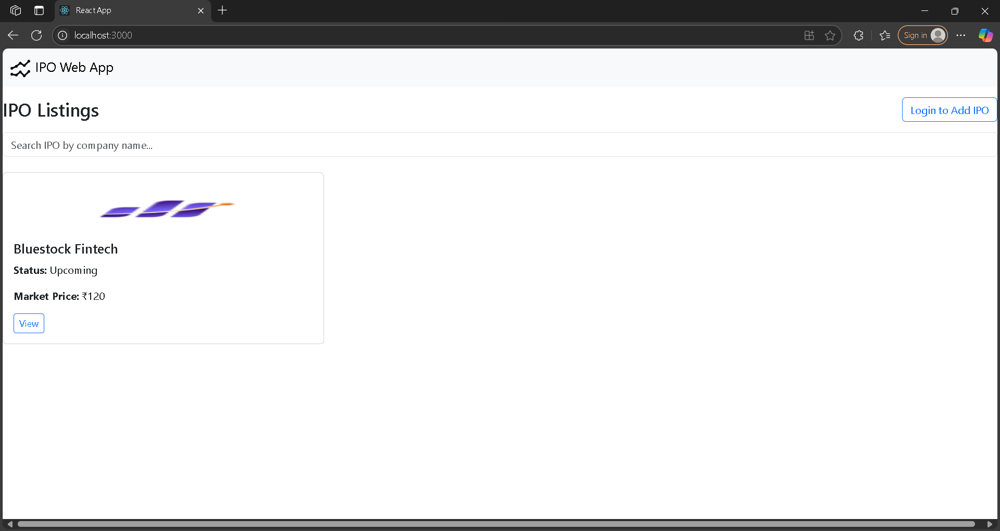
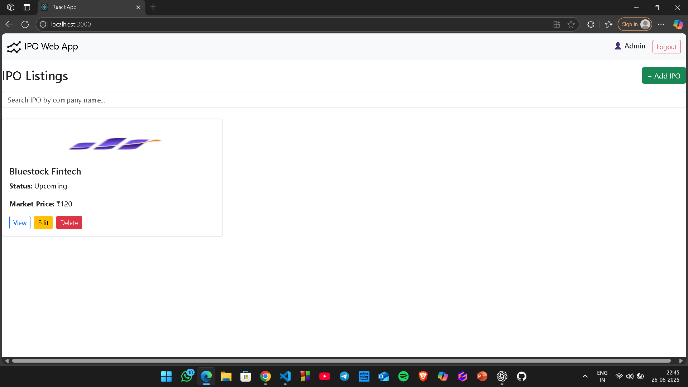

# 📈 IPO Web Application

A full-stack web application for managing IPO (Initial Public Offering) listings. Built with a modern tech stack using React (frontend), Node.js + Express (backend), and PostgreSQL (database). Developed as part of an internship project.

This app allows admins to **add, edit, or delete IPOs** with rich details including company logo, PDFs (RHP, DRHP), listing date, and pricing. Public users can **view IPOs** and search by company name.

---

## 🛠️ Tech Stack

### Frontend
- ⚛️ React
- 🅱️ Bootstrap 5
- 🔁 Axios
- 🔀 React Router DOM

### Backend
- 🟢 Node.js + Express
- 🧮 PostgreSQL
- 📂 Sequelize ORM
- 📤 Multer (File Upload)
- 🌿 dotenv

---

## 🚀 Features

- 🔐 Admin login/logout with protected routes
- ➕ Add new IPO entries with image and PDF upload
- 📝 Edit or delete IPOs (admin only)
- 🔍 Search IPOs by company name
- 📊 Display IPO return percentages
- 📁 View uploaded RHP and DRHP documents
- 🖼️ Responsive design using Bootstrap
- 🧪 API-first architecture with full CRUD support

---

## 📸 Screenshots


### 🏠 IPO Home Page  


---

### ➕ Add IPO LogIn Page  


---

### 🔍 IPO Features View  


---

## ⚙️ Getting Started

### 🧰 Backend Setup

```bash
cd backend
npm install
node index.js

### 🧰 Frontend Setup
```bash
cd ipo-web-react
npm install
npm start

### 🔑 Admin Credentials (for testing)
Username: admin
Password: 1234

### 📦 REST API Endpoints
```bash
| Method | Endpoint       | Description    |
| ------ | -------------- | -------------- |
| GET    | `/api/ipo`     | Get all IPOs   |
| GET    | `/api/ipo/:id` | Get IPO by ID  |
| POST   | `/api/ipo`     | Create new IPO |
| PUT    | `/api/ipo/:id` | Update IPO     |
| DELETE | `/api/ipo/:id` | Delete IPO     |

### 📂 Project Structure
ipo-web-app/
│
├── backend/              # Node.js + Express + Sequelize API
│   ├── controllers/
│   ├── routes/
│   ├── models/
│   └── index.js
│
├── ipo-web-react/        # React frontend
│   ├── src/
│   ├── public/
│   └── App.js
│
├── screenshots/          # Screenshots for GitHub README
│
├── .gitignore
├── README.md
└── package.json

